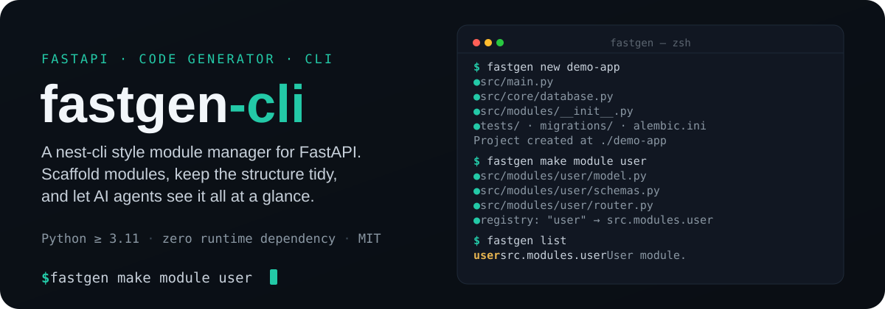
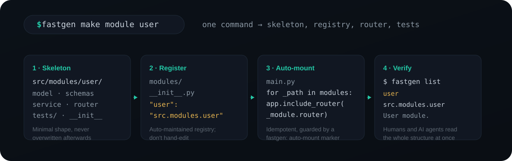

<div align="center">

# ⚡ fastgen-cli

**A nest-cli style module manager for FastAPI** — scaffold modules, keep the project tidy, and let AI agents see the whole structure at a glance.

Zero-config. One command. Fill in the business logic yourself.

[](https://pypi.org/project/fastgen-cli/)
[](https://pypi.org/project/fastgen-cli/)
[](LICENSE)
[](https://pypi.org/project/fastgen-cli/)

[English](README.md) | [简体中文](README.zh-CN.md)

</div>

<p align="center">
  
</p>

---

## ✨ Why fastgen-cli?

FastAPI is famously unopinionated — which is great for freedom, but bad for *structure*. Projects drift into chaos: routers scattered, entities everywhere, no one knows what modules exist.

**fastgen-cli** fixes exactly that. It manages **module structure**, not your business code:

- 🏗️ **Scaffold whole projects** — `fastgen new my-app` creates a best-practice `src/`-layout FastAPI project (`.env`, `src/main.py`, `src/core/`, module registry, `tests/`, Alembic migrations) ready to run
- 🗂️ **One module = one folder** (`<src>/modules/<feature>/`), with a consistent shape every time
- 🧩 **Minimal skeleton** — ORM model, schemas, service boundary, router + shared session dependency. Just enough to *see* the module, never enough to get in the way
- 📇 **Auto-maintained registry** — `<src>/modules/__init__.py` maps every module to its import path; AI agents and devs read it to understand the project instantly
- 🔌 **Shared DB core** generated once — `<src>/core/` with pydantic-settings config + async SQLAlchemy `get_session` (best-practice, `expire_on_commit=False`, `AsyncAttrs`)
- 🔁 **Alembic migrations out of the box** — `alembic upgrade head` evolves your schema instead of deleting `app.db`; autogenerate picks up model changes automatically
- 🛡️ **Never overwrites your code** — only generates what's missing or empty

---

## 📦 Installation

```bash
pip install fastgen-cli
# or
uv add fastgen-cli
```

> Requires **Python 3.11+**.

---

## 🚀 Quick start

```bash
# Scaffold a whole project (src/ layout: .env, src/main.py, src/core/, tests/, Alembic)
fastgen new my-app
cd my-app && uv sync && uv run alembic upgrade head && uv run uvicorn src.main:app --reload

# Scaffold a user module (creates src/modules/user/ + src/core/ + registry + tests)
fastgen make module user

# See all registered modules and their boundaries
fastgen list
```

That's it. No config file, no YAML, no spec — run a command, get the skeleton:

```
$ fastgen list
             Registered modules
┏━━━━━━━━┳━━━━━━━━━━━━━━━━━━┳━━━━━━━━━━━━━━━━┓
┃ module ┃ path             ┃ description    ┃
┡━━━━━━━━╇━━━━━━━━━━━━━━━━━━╇━━━━━━━━━━━━━━━━┩
│ user   │ src.modules.user │ User module.   │
└────────┴──────────────────┴────────────────┘
```

---

## 🔧 How it works

<p align="center">
  
</p>

Every `fastgen make module <feature>` command does four things, in order:

1. **Scaffold** — render the module skeleton into `<src>/modules/<feature>/` (model / schemas / service / router / tests). It only ever writes missing or empty files; anything already there stays untouched.
2. **Register** — add the module to the auto-maintained registry (`<src>/modules/__init__.py`), a plain `modules: dict[str, str]` mapping each module name to its import path.
3. **Auto-mount** — idempotently sync `<src>/main.py` so it imports the registry and calls `app.include_router(module.router)` for each entry, guarded by a `# --- fastgen: auto-mount (do not remove) ---` marker. No hand-editing `main.py` when adding modules.
4. **Verify** — `fastgen list` prints the registry as a table, so both you and AI agents see the whole module structure at a glance.

> `fastgen new <name>` is the same mechanism applied to a whole project: it scaffolds `src/core/`, the registry, `tests/`, Alembic migrations and `.fastgen.json`, then lets `make module` grow the app from there.

The registry is deliberately boring — one plain dict, no metadata, no framework:

```python
# src/modules/__init__.py — auto-maintained by fastgen
modules: dict[str, str] = {
    "user": "src.modules.user",
}

__all__ = ["modules"]
```

Because nothing generated by fastgen depends on fastgen at runtime, you can drop the tool anytime and keep a completely ordinary FastAPI project.

---

## 🧱 What it generates

### `fastgen new <name>`

A complete, runnable best-practice FastAPI project:

```
my-app/
├── .env / .env.example         # DATABASE_URL etc.
├── .gitignore                  # ignores .env, venv, __pycache__, *.db
├── .python-version             # 3.11
├── pyproject.toml              # deps + ruff / pytest config
├── README.md
├── .fastgen.json               # {"source_dir": "src"} — layout used by fastgen
├── src/
│   ├── __init__.py
│   ├── main.py                 # FastAPI app; module routers auto-load from the registry
│   ├── core/                   # shared infra (never overwritten)
│   │   ├── __init__.py
│   │   ├── config.py           # pydantic-settings Settings, reads .env
│   │   └── database.py         # Base (AsyncAttrs), async engine, get_session
│   └── modules/
│       └── __init__.py         # 📇 module registry (auto-maintained)
├── migrations/                  # Alembic migrations (alembic.ini at project root)
│   ├── env.py                   # async env; DATABASE_URL from settings, models from the registry
│   ├── script.py.mako
│   └── versions/
│       └── 0001_initial.py      # empty baseline revision
└── tests/
    ├── __init__.py
    ├── conftest.py             # httpx ASGI client fixture
    └── test_health.py          # /health smoke test
```

### `fastgen make module <feature>`

```
src/  (or app/ for a legacy project; fastgen auto-detects the layout)
├── core/                        # auto-created on first use (never overwritten)
│   ├── __init__.py
│   ├── config.py                # pydantic-settings Settings, DATABASE_URL from .env
│   └── database.py              # Base (AsyncAttrs), async engine, get_session
└── modules/
    ├── __init__.py              # 📇 module registry (auto-maintained)
    └── user/
        ├── __init__.py          # re-exports the router
        ├── model.py             # SQLAlchemy entity on Base (id PK, __tablename__ = plural)
        ├── schemas.py           # UserBase / UserCreate / UserUpdate / UserRead
        │                        # UserRead has from_attributes=True so ORM objects serialize
        ├── service.py           # business layer: UserError hierarchy + async CRUD stubs
        ├── router.py            # APIRouter + SessionDep (async DI wired)
        └── tests/               # in-memory SQLite test DB + get_session override
            ├── conftest.py
            └── test_user.py
```

Routers are **auto-mounted**: `fastgen make module` idempotently syncs `main.py`
to import registered modules from the registry and `app.include_router(...)` each —
no hand-editing `main.py` when adding a module (guarded by a `fastgen: auto-mount` marker).

**`router.py`** already wires the shared session dependency, so you just add endpoints:

```python
from typing import Annotated

from fastapi import APIRouter, Depends, HTTPException
from sqlalchemy.ext.asyncio import AsyncSession

from src.core.database import get_session
from src.modules.user.schemas import UserRead

SessionDep = Annotated[AsyncSession, Depends(get_session)]

router = APIRouter(prefix="/users", tags=["users"])

@router.get("", response_model=list[UserRead])
async def list_users(session: SessionDep) -> list[UserRead]:
    ...
```

---

## 🔁 Migrations (Alembic)

`fastgen new` ships Alembic scaffolding (`alembic.ini` + `migrations/`) wired to your
settings and models — schema is managed by migrations, not `create_all` at startup, so
you evolve the dev DB instead of deleting `app.db`.

```bash
uv run alembic upgrade head               # apply all pending migrations (baseline included)
uv run alembic revision --autogenerate -m "add user email"   # diff models -> new migration
uv run alembic upgrade head               # apply it
uv run alembic downgrade -1               # roll back one step
```

- `migrations/env.py` imports every registered module's `model` so autogenerate sees all tables.
- Adding Alembic to an **existing** project: `fastgen init alembic` writes the scaffolding
  idempotently (never overwrites). If the DB was already created via `create_all`, adopt it
  with `uv run alembic stamp head`, or drop the dev DB and re-create via `upgrade head`.

---

## ⚖️ How does it compare?

### vs. other FastAPI module generators & frameworks

| Tool | What it is | Runtime dependency you must keep | Generated module |
| --- | --- | --- | --- |
| **fastgen-cli** | Generator only — plain FastAPI | None | Model / schemas / service / router + tests + auto-maintained registry; Alembic migrations |
| **PyNest** | Framework on FastAPI (NestJS-style) | `pynest-api` (`nest.core`) | Module with `@Module` / `@Controller` / `@Injectable`, DI container |
| **FastKit** | Meta-framework + CLI (Laravel-style) | `fastkit-core` | Full CRUD module (model / schema / repository / service / router) |
| **Gondola** | CLI with Rails-like conventions | `gondola-cli` + default PostgreSQL stack | Models / routers / services / mailers / tests, Alembic migrations |
| **FastStack** | Full framework (Django-like) | `faststack-frame` | App module (models / routes / schemas / services / admin) |
| **RapidKit** | Module engine + CLI (FastAPI & NestJS) | `rapidkit-core` + npx/poetry toolchain | Kits (`fastapi.standard` / `fastapi.ddd`) + installable module catalog |

#### Where fastgen stands out

- **Zero runtime lock-in.** Everything fastgen generates is plain Python on top of vanilla FastAPI + SQLAlchemy — nothing requires `fastgen` at runtime. The others all ship their own framework/runtime that your project keeps depending on.
- **No new concepts to learn.** No `@Module`/`@Injectable` decorators, no DI container, no repository base classes, no workspace metadata. The skeleton uses idioms you already know (`SessionDep = Annotated[AsyncSession, Depends(get_session)]`).
- **Incremental, not all-or-nothing.** `fastgen make module` grows an *existing* project (`src/` or `app/` layout) instead of forcing you to start inside a framework — you can adopt it on top of any FastAPI project, including the ones above.
- **AI/agent-friendly.** An auto-maintained registry (`src/modules/__init__.py`) plus `fastgen list` means both humans and AI agents see the whole module structure at a glance.
- **Never overwrites.** `src/core/` is only generated when missing or empty.

#### Honest trade-off

The others generate **more for you**: FastKit's full CRUD router, Gondola's mailers, PyNest's dependency injection for complex enterprise apps, RapidKit's module upgrade/rollback lifecycle. Choose them when you want those batteries and can accept their runtime and conventions. Choose fastgen when you want a lean, standard, zero-coupling base that you shape yourself.

> **Contract-first generators** (`fastapi-code-generator`, OpenAPI Generator `python-fastapi`) are a different category: they turn an OpenAPI spec into code and complement fastgen when your spec is the source of truth.

### vs. starting with `uv init`

`uv init my-app` is the natural baseline — minimal, universal, no lock-in. The trade-offs:

| | `uv init` | `fastgen new` |
| --- | --- | --- |
| What you get | `pyproject.toml` + `main.py` hello world | Complete FastAPI app: `.env`, `src/main.py` (lifespan + `/health`), `src/core/` (pydantic-settings + async SQLAlchemy), module registry, `tests/`, Alembic migrations, ruff/pytest config |
| Then you must | Add deps, build the `src/` layout, write lifespan/config/DB/tests by hand | Add your business logic |
| Resulting structure | Differs per developer | Identical across projects |
| Module management later | None | `fastgen make module` keeps a registry you can `fastgen list` |
| Lock-in | None | Layout is plain files; drop fastgen anytime, nothing generated forces it |

**Pros of `uv init`**: universal, minimal, zero opinion, and you already have `uv` installed.
**Cons**: every FastAPI-specific decision (layout, DB session wiring, config, tests) is left to you, so each project ends up structured differently.

**Pros of `fastgen new`**: one command yields a complete best-practice base; consistent across the whole org; modules stay discoverable via the registry; never overwrites your code; easy for AI agents to reason about.
**Cons**: opinionated layout (`src/` + `core/` + registry) — if you need a non-standard structure you adapt it yourself; FastAPI-only.

**They're complementary, not competing**: a `fastgen new` project is still managed by `uv` (`uv sync`, `uv run`). And if you *did* start from `uv init`, you can adopt fastgen later — run `fastgen make module <feature>` in the project and it creates `core/`, `modules/` and the registry for you (it auto-detects the layout).

---

## 🛠️ CLI reference

| Command | Description |
| --- | --- |
| `fastgen new <name>` | Scaffold a new best-practice `src/`-layout FastAPI project (core + registry + tests + Alembic) |
| `fastgen make module <feature>` | Scaffold a feature module (model / schemas / service / router / tests), auto-mount its router, register it |
| `fastgen init alembic` | Add Alembic migration scaffolding to an existing project (idempotent) |
| `fastgen list` | List registered modules, import paths, and purposes |
| `fastgen --version` / `-V` | Show version |

### Options

| Flag | Applies to | Description |
| --- | --- | --- |
| `--dir <path>` / `-d` | `new`, `make module`, `init alembic`, `list` | Target project root (default: current dir) |
| `--title <name>` | `new` | Human-readable app title (defaults to the project name) |
| `--description <text>` | `new` | Short project description |
| `--dry-run` | `new`, `make module`, `init alembic` | Preview files without writing anything |
| `--force` / `-f` | `new`, `make module` | Overwrite existing files |

---

## 📐 Conventions (fixed)

- **Layout** — `fastgen new` creates a `src/` layout and records it in `.fastgen.json`. `fastgen` resolves `src` from `.fastgen.json`, then by auto-detection, and finally falls back to `app/` for existing projects.
- **Modules** live in `<src>/modules/<feature>/` — one business unit per folder, holding `model.py`, `schemas.py` (`XBase`/`XCreate`/`XUpdate`/`XRead`, with `from_attributes` on `XRead`), `service.py`, `router.py`, and `tests/`.
- **Router** exposes `prefix="/<plural>"` (REST-style), reuses `SessionDep` from `<src>.core.database`, and is **auto-mounted** into `main.py` from the registry (guarded by a `fastgen: auto-mount` marker — don't remove it).
- **Registry** — `<src>/modules/__init__.py` maps module name → import path. Always kept in sync by fastgen; don't hand-edit.
- **Core** — `<src>/core/config.py` and `database.py` are generated only when **missing or empty**. Existing code is never touched, even with `--force`.
- **Schema** — managed by Alembic migrations (not `create_all` at startup).

---

## 🔭 Roadmap

- [x] `new` — scaffold a whole best-practice `src/`-layout project
- [x] `make module` — model / schemas / service / router / tests + auto-mount
- [x] Module registry + `fastgen list`
- [x] Alembic migrations (`init alembic`, autogenerate, upgrade)
- [ ] `make resource` — full CRUD router generation

---

## 🧑‍💻 Development

```bash
git clone https://github.com/YIbaikaishui/fastgen-cli.git
cd fastgen-cli
uv sync
uv run fastgen --help
```

Lint with `uv run ruff check src`.

---

## 📄 License

MIT © 一白开水
