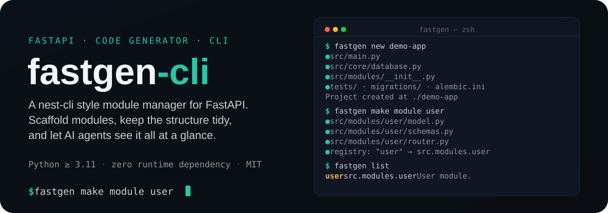
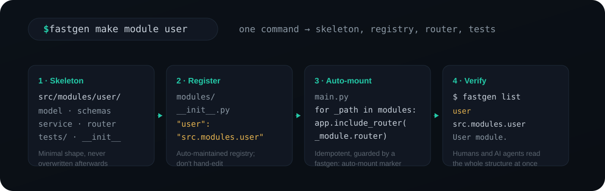

<div align="center">

# ⚡ fastgen-cli

**面向 FastAPI 的 nest-cli 风格模块管理器** —— 一键生成模块骨架，让项目结构保持整洁，让 AI 助手一眼看清整个项目。

零配置。一条命令。业务逻辑交给你。

[](https://pypi.org/project/fastgen-cli/)
[](https://pypi.org/project/fastgen-cli/)
[](https://www.rust-lang.org/)
[](LICENSE)
[](https://pypi.org/project/fastgen-cli/)

[English](README.md) | [简体中文](README.zh-CN.md)

</div>

<p align="center">
  
</p>

---

## ✨ 为什么选择 fastgen-cli？

FastAPI 以"不强制结构"著称——自由是好事，但项目也容易失控：路由散落各处、实体到处乱放、没人知道项目里到底有哪些模块。

**fastgen-cli** 正是来解决这个问题的。它管理**模块结构**，不碰你的业务代码：

- 🏗️ **一键脚手架整个项目**——`fastgen new my-app` 生成一个最佳实践的 `src/` 布局 FastAPI 项目（`.env`、`src/main.py`、`src/core/`、模块注册表、`tests/`、Alembic 迁移），开箱即跑
- 🗂️ **一个模块 = 一个文件夹**（`<src>/modules/<feature>/`），每次都是统一的结构
- ⚡ **Rust 二进制**——单一自包含可执行文件，瞬间启动，运行工具本身无需 Python 运行时
- 🤖 **AI 原生**——fastgen 管结构，`codex`/`opencode` 在结构里写代码
- 🧩 **最小骨架**——ORM 模型、schemas、业务层、路由 + 共享 session 依赖。刚好够"看懂"模块，绝不多生成代码挡住你
- 📇 **自动维护注册表**——`<src>/modules/__init__.py` 记录每个模块到其 import 路径的映射；AI 和开发者读它即可瞬间了解项目
- 🔌 **共享 DB 核心**只生成一次——`<src>/core/` 内含 pydantic-settings 配置 + 异步 SQLAlchemy `get_session`（最佳实践：`expire_on_commit=False`、`AsyncAttrs`）
- 🔁 **内置 Alembic 迁移**——`alembic upgrade head` 演进表结构，不用再删 `app.db`；autogenerate 自动识别模型变更
- 🛡️ **绝不覆盖你的代码**——只生成缺失或为空的内容

---

## 📦 安装

**通常你不需要安装任何东西。** `uvx` 按需运行：

```bash
uvx fastgen-cli make module order
```

天天用再装：

```bash
uv tool install fastgen-cli     # 或：pip install fastgen-cli / uv add fastgen-cli
```

`fastgen` 是一个自包含的 Rust 二进制，直接打进 wheel（uv 同款模式）——工具本身
不依赖 Python 运行时，安装后 `fastgen` 命令直接上 `PATH`。wheel 覆盖 Linux
（x86_64 / aarch64，glibc 2.17+）、macOS（Intel / Apple Silicon）和 Windows。

其他安装方式：

```bash
cargo install fastgen-cli    # 从 crates.io 安装（需要 Rust 工具链）
# 或从 GitHub Releases 下载预编译二进制：
# https://github.com/YIbaikaishui/fastgen-cli/releases/latest
```

它脚手架出来的项目则是普通的 **Python 3.11+** FastAPI 应用。

---

## 🚀 快速开始

**选一个 layout，拿到项目**——`fastgen new` 先问用哪个 layout，然后 `git clone`
下来（nunu 模式）：

```bash
uvx fastgen-cli new my-app
```

- **advanced**——带完整 CRUD 示例模块，推荐
- **auth**——JWT 鉴权开箱即用：注册、登录、受保护路由、bcrypt
- **basic**——最小项目，注册表为空
- **local**——内置脚手架：瞬时、离线、不需要 git

用 `--layout` 跳过交互：

```bash
uvx fastgen-cli new my-app --layout advanced
cd my-app && uv sync && uv run alembic upgrade head && uv run uvicorn src.main:app --reload
```

**直接在 GitHub 上浏览 layout**（它们就是普通仓库——clone 或点
*Use this template*）：
[advanced](https://github.com/YIbaikaishui/fastgen-layout-advanced) ·
[auth](https://github.com/YIbaikaishui/fastgen-layout-auth) ·
[basic](https://github.com/YIbaikaishui/fastgen-layout-basic)

**用自己的 layout**——指向任何 git 仓库（fork、公司规范、镜像）：

```bash
uvx fastgen-cli new my-app -r https://gitee.com/your-org/fastgen-layout-advanced.git
```

**随时加模块**——一条命令，`main.py` 永远不用手改：

```bash
uvx fastgen-cli make module order
```

**随时看全貌**——给你，也给 AI 智能体：

```bash
uvx fastgen-cli list
```

就是这样。没有配置文件、没有 YAML、没有 spec——一条命令，拿到骨架：

```
$ fastgen list
             Registered modules
┏━━━━━━━━┳━━━━━━━━━━━━━━━━━━┳━━━━━━━━━━━━━━━━┓
┃ module ┃ path             ┃ description    ┃
┡━━━━━━━━╇━━━━━━━━━━━━━━━━━━╇━━━━━━━━━━━━━━━━┩
│ user   │ src.modules.user │ User module.   │
└────────┴──────────────────┴────────────────┘
```

---

## 🔧 工作原理

<p align="center">
  
</p>

每次执行 `fastgen make module <feature>` 都会按顺序做四件事：

1. **生成骨架**——把模块骨架渲染进 `<src>/modules/<feature>/`（model / schemas / service / router / tests）。只写缺失或为空的文件，已有内容一律不动。
2. **登记注册表**——把模块写进自动维护的注册表（`<src>/modules/__init__.py`），一个朴素的 `modules: dict[str, str]`，记录每个模块名到 import 路径的映射。
3. **自动挂载**——幂等地同步 `<src>/main.py`，让它从注册表导入各模块并 `app.include_router(module.router)`，由 `# --- fastgen: auto-mount (do not remove) ---` 标记守护。新增模块无需手改 `main.py`。
4. **验证**——`fastgen list` 把注册表打印成表格，你和 AI 助手一眼看清整个模块结构。

> `fastgen new <name>` 是同一套机制用在整个项目上：它生成 `src/core/`、注册表、`tests/`、Alembic 迁移和 `.fastgen.json`，之后用 `make module` 逐步长出自己的业务。

注册表刻意做得朴素——一个普通 dict，没有元数据、没有框架：

```python
# src/modules/__init__.py —— 由 fastgen 自动维护
modules: dict[str, str] = {
    "user": "src.modules.user",
}

__all__ = ["modules"]
```

因为 fastgen 生成的一切在运行时都不依赖 fastgen，所以随时可以卸载这个工具，留下的仍是一个完全普通的 FastAPI 项目。

---

## 🤖 可选：AI 智能体（codex / opencode）

默认情况下 fastgen 是纯粹的确定性脚手架——不需要智能体、不需要 API key，
除了 `uv` 什么都不用装。想让智能体把骨架填成真实代码，用 `--ai`  opt in：

```bash
npm install -g @openai/codex   # 或：curl -fsSL https://opencode.ai/install | bash

fastgen new myapp --ai "任务管理 API，带项目和任务"
fastgen make module order --ai "明细行、状态枚举、金额汇总"
```

工作流程：

1. fastgen 渲染确定性骨架（毫秒级、字节级稳定）
2. 智能体（优先 `codex`，备选 `opencode`；`--agent` 可强制指定）按编码了 fastgen 约定的 prompt 填充代码
3. fastgen **验证并校正**：报告智能体改动的文件、自动登记它创建的模块、重新同步自动挂载块、并对结果跑 `python -m py_compile`

用 `--agent codex|opencode` 指定智能体，或用 `FASTGEN_AGENT_CMD` 指向任何其他
CLI 智能体（如 `FASTGEN_AGENT_CMD="claude -p"`）；`--dry-run` 只预览骨架，不启动智能体。

## 🧱 生成的内容

### `fastgen new <name>`

一个完整、可直接运行的最佳实践 FastAPI 项目：

```
my-app/
├── .env / .env.example         # DATABASE_URL 等
├── .gitignore                  # 忽略 .env、venv、__pycache__、*.db
├── .python-version             # 3.11
├── pyproject.toml              # 依赖 + ruff / pytest 配置
├── README.md
├── .fastgen.json               # {"source_dir": "src"} —— fastgen 依据它识别布局
├── src/
│   ├── __init__.py
│   ├── main.py                 # FastAPI 应用；模块路由从注册表自动加载
│   ├── core/                   # 共享基础设施（绝不覆盖）
│   │   ├── __init__.py
│   │   ├── config.py           # pydantic-settings 配置，读 .env
│   │   └── database.py         # Base（AsyncAttrs）、异步 engine、get_session
│   └── modules/
│       └── __init__.py         # 📇 模块注册表（自动维护）
├── migrations/                  # Alembic 迁移（alembic.ini 在项目根目录）
│   ├── env.py                   # 异步环境；DATABASE_URL 来自配置，模型来自注册表
│   ├── script.py.mako
│   └── versions/
│       └── 0001_initial.py      # 空基线版本
└── tests/
    ├── __init__.py
    ├── conftest.py             # httpx ASGI client fixture
    └── test_health.py          # /health 冒烟测试
```

### `fastgen make module <feature>`

```
src/  （旧项目则为 app/；fastgen 自动识别布局）
├── core/                        # 首次使用时自动创建（绝不覆盖）
│   ├── __init__.py
│   ├── config.py                # pydantic-settings 配置，DATABASE_URL 读自 .env
│   └── database.py              # Base（AsyncAttrs）、异步 engine、get_session
└── modules/                     # 📇 垂直切片：一个文件夹对应一个业务域
    ├── __init__.py              # 模块注册表（自动维护）
    └── user/                    # 每个模块内部再分层
        ├── __init__.py          # 对外暴露 .api.router 的 router
        ├── domain/              # 实体 + 仓库端口（无 I/O 或框架）
        │   ├── model.py         # SQLAlchemy 实体（__tablename__ = 复数）
        │   └── repository.py    # UserRepository Protocol（add/get/list/delete）
        ├── application/         # 用例 + DTO（不涉及 HTTP）
        │   ├── schemas.py       # UserBase / UserCreate / UserUpdate / UserRead
        │   │                    # UserRead 带 from_attributes=True，ORM 对象可直接序列化
        │   └── user_service.py  # UserService（构造注入仓库）+ UserError 异常层级
        ├── infrastructure/      # 仓库端口的 SQLAlchemy 适配实现
        │   └── user_repository.py
        ├── api/                 # FastAPI 层：SessionDep + router，把异常映射为 HTTP
        │   └── router.py        # APIRouter（prefix="/users"）
        └── tests/               # 内存 SQLite 测试库 + get_session 覆盖
            ├── conftest.py
            └── test_user.py
```

**路由自动挂载**：`fastgen make module` 会幂等地把 `main.py` 同步为从注册表
`importlib` 导入各模块并 `app.include_router(...)`——新增模块无需手改 `main.py`
（由 `fastgen: auto-mount` 标记注释守护）。

`fastgen make module` 会生成上面整套垂直切片骨架，每层都已接好共享 session 依赖，
你只需添加端点和业务逻辑。生成的 `router.py` 形如：

```python
from typing import Annotated

from fastapi import APIRouter, Depends, HTTPException
from sqlalchemy.ext.asyncio import AsyncSession

from src.core.database import get_session
from src.modules.user.application.user_service import UserNotFound, UserService
from src.modules.user.domain.model import User
from src.modules.user.infrastructure.user_repository import SqlUserRepository

SessionDep = Annotated[AsyncSession, Depends(get_session)]

router = APIRouter(prefix="/users", tags=["users"])


def _service(session: AsyncSession) -> UserService:
    return UserService.from_repository(SqlUserRepository(session))


@router.get("", response_model=list[User])
async def list_users(session: SessionDep) -> list[User]:
    ...
```

---

## 🔁 迁移（Alembic）

`fastgen new` 内置 Alembic 脚手架（`alembic.ini` + `migrations/`），已接好你的配置和
模型——表结构由迁移管理，而不是启动时 `create_all`，开发时演进 schema 不用再删 `app.db`：

```bash
uv run alembic upgrade head               # 应用所有待执行迁移（含基线）
uv run alembic revision --autogenerate -m "add user email"   # 模型 diff -> 新迁移
uv run alembic upgrade head               # 应用它
uv run alembic downgrade -1               # 回滚一步
```

- `migrations/env.py` 会导入注册表里每个模块的 `model`，autogenerate 才能看到全部表。
- 给**已有项目**加 Alembic：`fastgen init alembic` 幂等写入脚手架（绝不覆盖）。
  若数据库此前由 `create_all` 创建，用 `uv run alembic stamp head` 采纳现状，或删掉开发库后 `upgrade head` 重建。

---

## 🩺 doctor——让结构保持诚实

项目越长，注册表越容易漂移：有人删了模块目录却没删注册项（`main.py` 启动即崩），
有人手建了模块却没登记（路由永远不挂载）。`doctor` 让漂移可见，并且能修：

```bash
fastgen doctor            # 报告；应用已损坏时退出码 1
fastgen doctor --fix      # 登记遗漏模块、清除失效项、重新注入挂载块
fastgen doctor --strict   # 警告也算失败
fastgen doctor --json     # 给脚本和 CI
```

在 CI 里卡住：

```yaml
- run: uvx fastgen-cli doctor --strict
```

---

## ⚖️ 它和别的方案比怎么样？

### 与其他 FastAPI 模块生成器 / 框架对比

| 工具 | 是什么 | 你必须保留的运行时依赖 | 生成的模块 |
| --- | --- | --- | --- |
| **fastgen-cli** | 纯生成器——裸 FastAPI（Rust CLI） | 无 | 模型 / schemas / service / router / tests + 自动维护的注册表；Alembic 迁移 |
| **PyNest** | 构建在 FastAPI 上的框架（NestJS 风格） | `pynest-api`（`nest.core`） | 带 `@Module` / `@Controller` / `@Injectable` 与 DI 容器的模块 |
| **FastKit** | 元框架 + CLI（Laravel 风格） | `fastkit-core` | 完整 CRUD 模块（model / schema / repository / service / router） |
| **Gondola** | 强调约定的 CLI（Rails 风格） | `gondola-cli` + 默认 PostgreSQL 技术栈 | models / routers / services / mailers / tests，Alembic 迁移 |
| **FastStack** | 完整框架（Django 风格） | `faststack-frame` | 应用模块（models / routes / schemas / services / admin） |
| **RapidKit** | 模块引擎 + CLI（同时支持 FastAPI 与 NestJS） | `rapidkit-core` + npx/poetry 工具链 | Kits（`fastapi.standard` / `fastapi.ddd`）+ 可安装的模块目录 |

#### fastgen 的优势在哪

- **零运行时锁定。** fastgen 生成的一切都是基于裸 FastAPI + SQLAlchemy 的纯 Python 代码，运行时完全不需要 `fastgen`。其他工具都自带框架/运行时，你的项目得一直依赖它们。
- **没有需要学习的新概念。** 没有 `@Module`/`@Injectable` 装饰器、没有 DI 容器、没有 repository 基类、没有 workspace 元数据。骨架用的都是你本来就会的写法（`SessionDep = Annotated[AsyncSession, Depends(get_session)]`）。
- **增量式，而不是一次性全有。** `fastgen make module` 是在*已有*项目（`src/` 或 `app/` 布局）里生长，而不是逼你从一开始就进入某个框架——任何 FastAPI 项目（包括上面这些工具的项目）都能叠加使用。
- **对 AI/助手友好。** 自动维护的注册表（`src/modules/__init__.py`）+ `fastgen list`，让人类和 AI 助手都能一眼看清整个模块结构。
- **绝不覆盖。** `src/core/` 只在缺失或为空时生成。

#### 客观的取舍

其他工具帮你生成的**更多**：FastKit 的完整 CRUD 路由、Gondola 的 mailers、PyNest 面向复杂企业应用的依赖注入、RapidKit 的模块升级/回滚生命周期。想要这些能力、且能接受其运行时与约定时，选它们。想要一个精简、标准、零耦合、由你自己塑造的底座时，选 fastgen。

> **契约优先生成器**（`fastapi-code-generator`、OpenAPI Generator `python-fastapi`）是另一类：它们把 OpenAPI spec 变成代码。当你的 spec 是唯一事实来源时，它们与 fastgen 互补。

### 与直接用 `uv init` 起步对比

`uv init my-app` 是最自然的基线——极简、通用、无锁定。权衡如下：

| | `uv init` | `fastgen new` |
| --- | --- | --- |
| 得到什么 | `pyproject.toml` + `main.py` hello world | 完整 FastAPI 应用：`.env`、`src/main.py`（lifespan + `/health`）、`src/core/`（pydantic-settings + 异步 SQLAlchemy）、模块注册表、`tests/`、Alembic 迁移、ruff/pytest 配置 |
| 接下来你要 | 手写依赖、`src/` 布局、lifespan/配置/数据库/测试 | 只管写业务逻辑 |
| 最终结构 | 每个开发者都不同 | 所有项目完全一致 |
| 后续模块管理 | 无 | `fastgen make module` 维护注册表，可随时 `fastgen list` |
| 锁定风险 | 无 | 布局就是普通文件；任何时候都能删掉 fastgen，生成物不强制依赖它 |

**`uv init` 的优点**：通用、极简、零意见，而且你本来就有 `uv`。
**缺点**：所有 FastAPI 相关的决定（布局、DB session 接线、配置、测试）都留给你自己，于是每个项目结构都不一样。

**`fastgen new` 的优点**：一条命令得到完整的最佳实践底座；整个团队保持一致；模块通过注册表随时可发现；绝不覆盖你的代码；方便 AI 助手理解项目。
**缺点**：布局有主见（`src/` + `core/` + 注册表）——需要非标准结构时得自己改；只面向 FastAPI。

**二者互补，而非竞争**：`fastgen new` 生成的项目仍由 `uv` 管理（`uv sync`、`uv run`）。如果你确实是从 `uv init` 起步的，之后也能无缝接入 fastgen——在项目里跑 `fastgen make module <feature>` 即可，它会自动创建 `core/`、`modules/` 和注册表（并能自动识别布局）。

---

## 🛠️ CLI 参考

| 命令 | 说明 |
| --- | --- |
| `fastgen new <name>` | 脚手架一个新的最佳实践 `src/` 布局 FastAPI 项目（core + 注册表 + tests + Alembic） |
| `fastgen make module <feature>` | 生成垂直切片模块骨架（domain / application / infrastructure / api / tests）、自动挂载路由并登记注册表 |
| `fastgen init alembic` | 给已有项目添加 Alembic 迁移脚手架（幂等） |
| `fastgen list` | 列出已注册模块、import 路径和用途 |
| `fastgen doctor [--fix] [--strict] [--json]` | 检查结构漂移（失效注册项、未登记模块、缺失自动挂载、语法错误）；有错误时退出码 1——可用于 CI 卡点 |
| `fastgen --version` / `-V` | 显示版本号 |

### 选项

| 参数 | 适用命令 | 说明 |
| --- | --- | --- |
| `--dir <path>` / `-d` | `new`、`make module`、`init alembic`、`list` | 目标项目根目录（默认当前目录） |
| `--title <name>` | `new` | 人类可读的应用标题（默认取项目名） |
| `--layout <名称>` | `new` | layout：`advanced`、`basic`、`local` 或 git URL/路径（终端里交互选择） |
| `--repo <url>` / `-r` | `new` | `--layout <url>` 的简写——clone 任何 layout 仓库 |
| `--description <text>` | `new` | 简短的项目描述 |
| `--ai <规格>` | `new`、`make module` | 交给填充骨架的 AI 智能体的自然语言描述 |
| `--agent <名称>` | 所有命令 | 强制使用 `codex` 或 `opencode`（默认自动探测） |
| `--dry-run` | `new`、`make module`、`init alembic` | 预览将要生成的文件，不写入任何内容（不启动智能体） |
| `--force` / `-f` | `new`、`make module` | 覆盖已存在的文件 |

---

## 📐 固定约定

- **布局**——`fastgen new` 生成 `src/` 布局并记录到 `.fastgen.json`。fastgen 依次按 `.fastgen.json`、自动探测、最后回退到 `app/`（兼容旧项目）的顺序解析布局。
- **模块**位于 `<src>/modules/<feature>/`——一个文件夹对应一个业务单元，按**垂直切片**生成：`domain/`（`model.py` + `repository.py` 端口）、`application/`（`schemas.py` 的 `XBase`/`XCreate`/`XUpdate`/`XRead`，`XRead` 带 `from_attributes`，加 `<feature>_service.py`）、`infrastructure/`（`Sql*Repository`）、`api/`（`router.py`）、`tests/`。
- **路由**暴露 `prefix="/<复数形式>"`（REST 风格），复用 `<src>.core.database` 里的 `SessionDep`，从注册表**自动挂载**进 `main.py`（由 `fastgen: auto-mount` 标记守护——别删），并把领域异常映射为 `HTTPException`。
- **注册表**——`<src>/modules/__init__.py` 保存"模块名 → import 路径"映射，由 fastgen 自动保持同步，请勿手改。
- **核心**——`<src>/core/config.py` 和 `database.py` 只在**缺失或为空**时生成。已有代码即使加 `--force` 也绝不触碰。
- **表结构**——由 Alembic 迁移管理（启动时不再 `create_all`）。

---

## 🔭 Roadmap

- [x] `new` —— 脚手架整个最佳实践 `src/` 布局项目
- [x] `make module` —— model / schemas / service / router / tests + 自动挂载
- [x] 模块注册表 + `fastgen list`
- [x] Alembic 迁移（`init alembic`、autogenerate、upgrade）
- [x] AI 智能体集成 —— `codex`/`opencode` 填充骨架（`--ai`），fastgen 验证并校正
- [ ] 更多 layout ——带鉴权、任务队列、微服务（各自独立仓库，nunu 模式）
- [ ] `make resource` —— 完整 CRUD 路由生成

---

## 🧑‍💻 开发

```bash
git clone https://github.com/YIbaikaishui/fastgen-cli.git
cd fastgen-cli
cargo build --release
cargo test
```

代码检查 / 格式化：`cargo clippy --all-targets` 和 `cargo fmt --check`。

发布 wheel 到 PyPI（uv 模式——用 `maturin` + `ziglang` 出低 glibc 兼容的 wheel）：

```bash
maturin build --release --zig --target <target>   # 每个平台一次
maturin sdist
maturin publish
```

---

## 📄 协议

MIT © 一白开水
